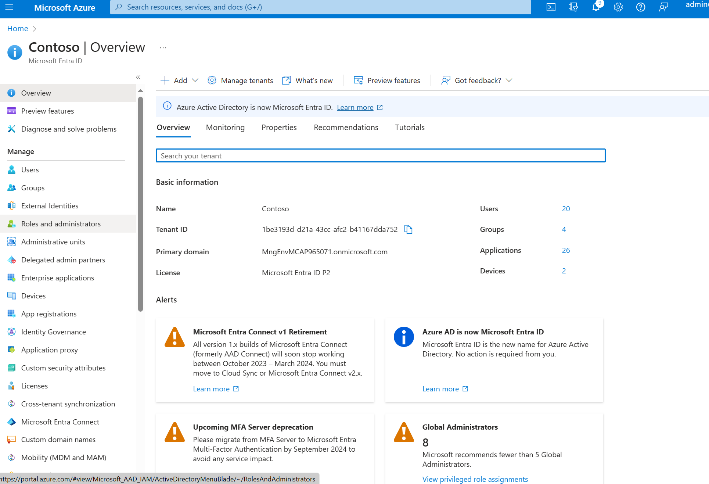
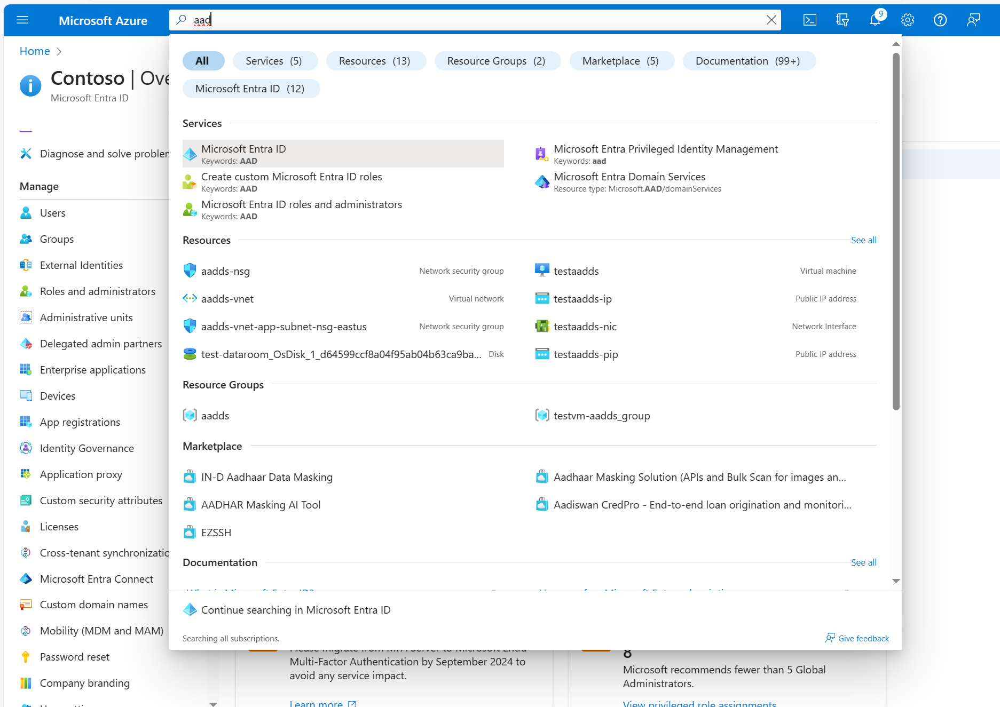
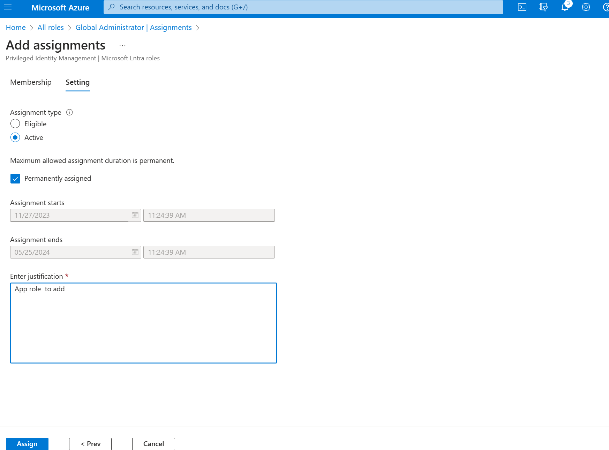
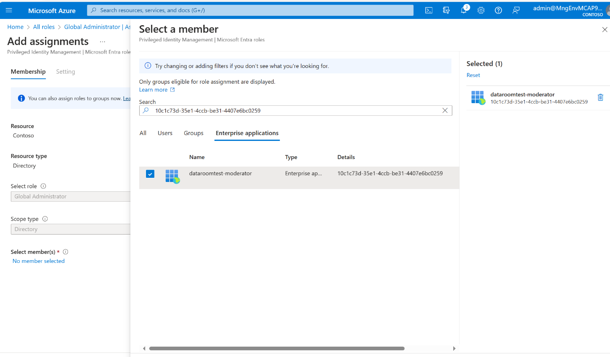
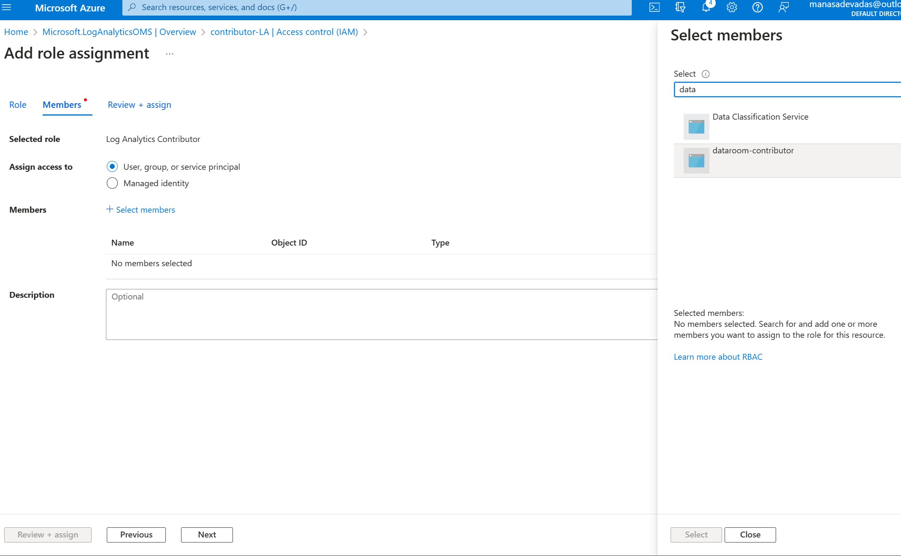

# dedomena

Dedomena is an all PaaS clean room setup on an Azure, including ML workspaces for quick data room exercises.

## What is a data room?

A data room is a physical or online space set up by the seller to collate and store information about the target company and its business for the purposes of completing or rather satisfying the buyer's due diligence exercise. Physical data rooms – which are becoming increasingly uncommon – house hard copy documents in a room (normally in the offices of the sellers or their advisers) which is supervised by a representative of the seller (this would often be their solicitor). This contrasts with online data rooms – commonly referred to as virtual data rooms – which are made available through a secure internet site and act as a digital document repository. 

[Click here for further reading](https://www.lexology.com/library/detail.aspx?g=64a7f45c-14e3-450f-bd65-523d4aa3945c#:~:text=A%20data%20room%20is%20a,the%20buyer's%20due%20diligence%20exercise.)

Data rooms are an essential part of the due diligence process which, if administered correctly, should encourage collaboration and communication between the involved parties by facilitating the exchange of confidential information in a secure manner.

## Definitions

Moderator: This dataroom is setup on Azure, the client who owns the [subscription](https://azure.microsoft.com/en-in/free/search/?ef_id=_k_CjwKCAjwvrOpBhBdEiwAR58-3JhsLhAcMotjCRorPVXXxfwxJl5h824QaCEv9Oh7HjfmgsiucAzAjhoCvzcQAvD_BwE_k_&OCID=AIDcmmf1elj9v5_SEM__k_CjwKCAjwvrOpBhBdEiwAR58-3JhsLhAcMotjCRorPVXXxfwxJl5h824QaCEv9Oh7HjfmgsiucAzAjhoCvzcQAvD_BwE_k_&gclid=CjwKCAjwvrOpBhBdEiwAR58-3JhsLhAcMotjCRorPVXXxfwxJl5h824QaCEv9Oh7HjfmgsiucAzAjhoCvzcQAvD_BwE) is henceforth refered as the moderator. The moderator is also the one who runs the current automation and create a setup from ground up.

Contributor: Contributors will be given access to the above subscription by the moderator. Contributors can work on the data that is brought into the subscription by the moderator.

## Getting Started

This setup includes a bunch of Azure PaaS components, that will be spun by the moderator

### Moderator

#### Step 1

Get an Azure subscription created

#### Step 2

[Create a Service Principal](https://learn.microsoft.com/en-us/entra/identity-platform/howto-create-service-principal-portal) in the customer tenant on Azure Active Directory. 

#### Step 3

Create the client secret and please note down these values

#### Step 4

Add the app role `AppRoleAssignment.ReadWrite.All`. 

Add the role `Global administrator` to the service principal

Search for the corresponding `Entra ID`

Search for the role `Global Administrator`

Click on `Add Assignments`

Add the required `assignment`

Select the moderator account - the moderator account you have created and make it a
`Global Admin`

#### Step 5

Give the Service Principal owner role to the subscription. (Unconstrained). 
Need to search by the app-name to find the tenant and assign the role. 

> Once you have the above values, fill the same in values.yaml 
> in the moderator client section, along with the desired user ids. 

### Contributor

- Create a service principal (Multitenant) as the above, only difference is to select `Multitenant` option.
- Create a client secret and note down the values.
- Create a log analytics workspace on Azure
- Give the Multitenant Service Principal role namely – Log analytics contributor access.

- Fill in values.yaml with the details of subscription,Service Principal and log analytics name.

> Log Analytics namespace is required by the contributor to have the audit history of the actions
> performed on the dataroom by the moderator. The intention is to audit these actions for future deliberation 
> should there be any. 

### Connecting with SFTP on Blob Storage 

> Once the setup is done, if you intend to move files from/to SFTP, please follow the below

[Connecting with SFTP](https://learn.microsoft.com/en-us/azure/storage/blobs/secure-file-transfer-protocol-support-how-to?tabs=azure-portal)

### How to Run

Run the setup.sh once you have the required values.yaml populated by the moderator. It sets up a dataroom on an azure resource group, with the following components

- Storage Account and Containers
- Randomized Passwords for the same
- An ML workspace
- Key Vault and Secret Manager
- Azure Sentinel
- Synapse Spark Tool
- Audit Logs pushed to contributors Log Analytics account.
- Secrets managed in key vault

Run the destroy.sh to destroy the resource group once the dataroom's purpose has been met.

### Supported Environments

- Debian Based Linux Distributions

LICENSE
-------

Copyright 2023 PhonePe Private Limited

Licensed under the Apache License, Version 2.0 (the "License");
you may not use this file except in compliance with the License.
You may obtain a copy of the License at

http://www.apache.org/licenses/LICENSE-2.0

Unless required by applicable law or agreed to in writing, software
distributed under the License is distributed on an "AS IS" BASIS,
WITHOUT WARRANTIES OR CONDITIONS OF ANY KIND, either express or implied.
